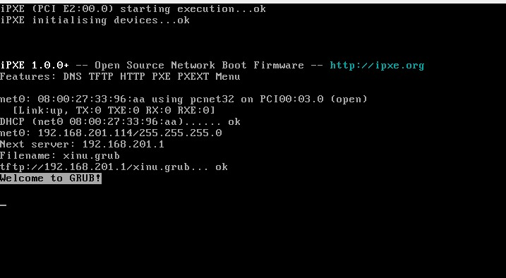
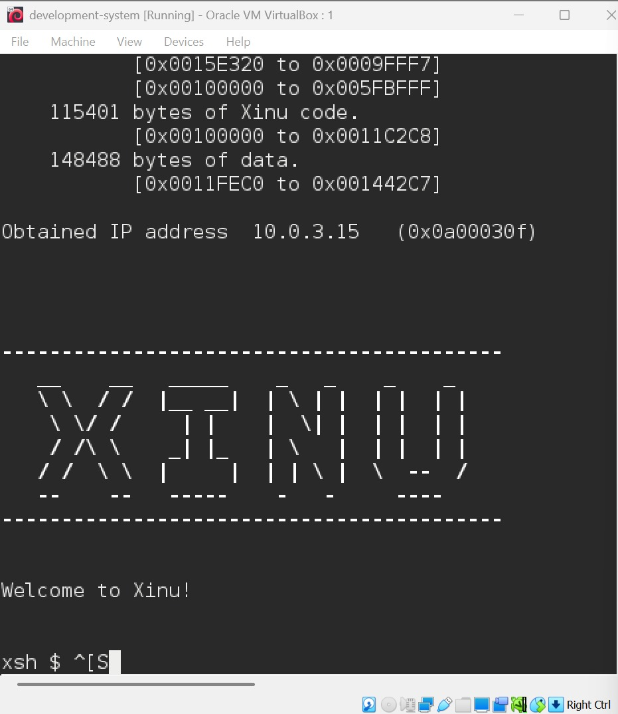
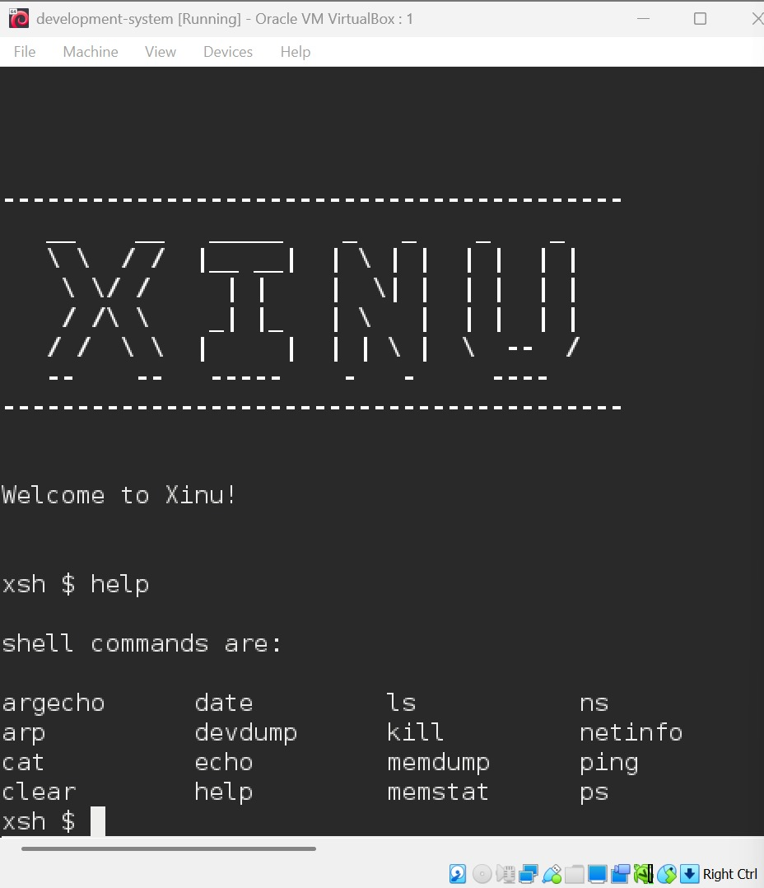

# Laporan Praktikum Sistem Operasi

## Modul 1, 2, dan 3: Instalasi, Arsitektur, dan Eksplorasi Xinu OS

### Identitas Praktikan

| Item                  | Keterangan                |
| --------------------- | ------------------------- |
| **Nama**              | Archilia Friti Simbala    |
| **NIM**               | 108072500180              |
| **Kelas**             | IF 05-04                  |
| **Asisten Praktikum** | Nuevalen Refitra Alswando |
| **Tanggal Praktikum** | 25-09-2026                |

---

## 1. Tujuan Praktikum

1. Memahami tata tertib serta persiapan tools yang digunakan dalam praktikum Sistem Operasi, seperti VirtualBox, Ubuntu, Xinu OS, dan Sourcetrail.
2. Memahami konsep arsitektur cross-development pada Xinu OS yang memisahkan Development-System VM dan Backend VM.
3. Mampu melakukan proses kompilasi source code Xinu dan menjalankannya pada mesin target menggunakan jaringan PXE/TFTP.
4. Mampu mengakses serta mencoba perintah dasar shell Xinu melalui koneksi serial menggunakan Minicom.

---

## 2. Dasar Teori dan Arsitektur Sistem

Xinu OS merupakan sistem operasi sederhana yang dibuat untuk digunakan pada lingkungan embedded. Pengembangannya menggunakan konsep **cross-development**, yaitu proses penulisan dan kompilasi program dilakukan pada komputer host, kemudian hasil kompilasi dijalankan pada mesin target.

Pada praktikum ini digunakan dua buah mesin virtual, yaitu:

1. **Development-System VM**, yang digunakan sebagai tempat menjalankan Debian Linux, source code Xinu, compiler, DHCP Server, dan TFTP Server.
2. **Backend VM**, yang berperan sebagai mesin target untuk menjalankan Xinu OS. Mesin ini melakukan booting melalui jaringan dengan mengambil image Xinu dari TFTP Server.

Kedua VM juga terhubung melalui virtual serial port sehingga praktikan dapat berkomunikasi dengan Xinu menggunakan terminal pada Development-System.

Arsitektur ini memudahkan proses pengembangan karena proses kompilasi dilakukan pada lingkungan host, sedangkan Backend VM digunakan untuk mensimulasikan perangkat target seperti pada sistem embedded.

---

## 3. Langkah Kerja dan Hasil Eksplorasi

### 3.1 Login dan Kompilasi Source Code Xinu

Tahap pertama dilakukan pada Development-System VM. Setelah mesin virtual dijalankan, praktikan melakukan login menggunakan akun yang telah disediakan.

* **Username**: `xinu`
* **Password**: `xinurocks`

Setelah berhasil login, terminal dibuka dan praktikan masuk ke direktori tempat proses kompilasi Xinu dilakukan. Sebelum melakukan kompilasi, build sebelumnya dibersihkan terlebih dahulu agar hasil yang dibuat merupakan versi terbaru.

```bash
$ cd xinu/compile
$ make clean
$ make
```

**Hasil:** Perintah `make` melakukan proses kompilasi seluruh source code C menjadi image Xinu, yaitu `xinu.elf`. Setelah proses selesai, file hasil kompilasi akan ditempatkan pada direktori TFTP sehingga dapat digunakan oleh mesin target. Tahap ini diperlukan agar source code Xinu yang telah diperbarui dapat dijalankan pada Backend VM.


*Gambar 1: Proses kompilasi source code Xinu menggunakan perintah `make` pada Development-System VM.*

### 3.2 Booting Backend VM melalui PXE

Setelah proses kompilasi selesai, tahap selanjutnya adalah menjalankan Backend VM. Mesin target tidak menggunakan sistem operasi yang terpasang pada harddisk, sehingga proses boot dilakukan melalui jaringan menggunakan PXE.

Proses booting yang terjadi meliputi:

1. Backend VM menampilkan bootloader GRUB.
2. Backend VM meminta alamat IP kepada DHCP Server yang terdapat pada Development-System VM.
3. Backend VM mengambil file `xinu.boot` melalui TFTP Server.
4. Image Xinu dimuat ke dalam memori dan kemudian sistem mulai menjalankan Xinu OS.

Dari proses tersebut dapat diketahui bahwa Backend VM dapat menjalankan sistem operasi tanpa membutuhkan media penyimpanan lokal karena file yang dibutuhkan diperoleh melalui jaringan.



*Gambar 2: Tampilan Backend VM ketika melakukan proses network booting melalui PXE dan memuat GRUB.*

### 3.3 Koneksi Serial Port Menggunakan Minicom

Untuk melakukan interaksi dengan Xinu yang sedang berjalan pada Backend VM, praktikan kembali menggunakan Development-System VM dan menjalankan Minicom sebagai terminal serial.

```bash
$ sudo minicom
```

Password yang digunakan ketika menjalankan Minicom adalah:

```bash
xinurocks
```

**Hasil:** Setelah koneksi berhasil, terminal Development-System dapat digunakan untuk berkomunikasi dengan console Xinu pada Backend VM. Hal ini ditandai dengan munculnya prompt `xsh$`, yang menunjukkan bahwa praktikan telah masuk ke shell Xinu.



*Gambar 3: Koneksi Minicom berhasil dan ditandai dengan munculnya prompt `xsh$`.*

### 3.4 Eksplorasi Perintah Shell Xinu

Setelah berhasil masuk ke shell Xinu, praktikan mencoba beberapa perintah yang tersedia. Perintah awal yang digunakan adalah `help` untuk melihat daftar command yang dapat digunakan.

```bash
xsh$ help
```

Perintah tersebut menampilkan berbagai command dasar yang tersedia pada Xinu. Praktikan juga mencoba beberapa perintah lain seperti `ls`, `cd`, dan perintah dasar lainnya untuk mengetahui cara kerja serta struktur navigasi pada shell Xinu.

Dari hasil percobaan tersebut dapat diketahui bahwa Xinu memiliki shell yang sederhana, tetapi tetap menyediakan fungsi dasar yang diperlukan untuk berinteraksi dengan sistem.



*Gambar 4: Tampilan output perintah `help` yang berisi daftar command pada Xinu OS.*

---

## 4. Pembahasan

Berdasarkan praktikum yang telah dilakukan, terdapat beberapa hal penting yang dapat dipahami mengenai arsitektur dan mekanisme kerja Xinu OS.

1. **Pemisahan Host dan Target (Cross-Development)**
   Xinu menggunakan konsep cross-development dengan memisahkan komputer yang digunakan untuk mengembangkan dan mengompilasi program dengan mesin yang digunakan sebagai target. Hal ini umum digunakan pada pengembangan sistem embedded.

2. **Mekanisme Network Booting (PXE dan TFTP)**
   Backend VM dapat menjalankan Xinu tanpa menggunakan sistem operasi yang tersimpan pada harddisk. Saat melakukan booting, mesin target memperoleh alamat IP melalui DHCP kemudian mengambil file boot melalui TFTP.

3. **Peran Serial Port dan Minicom**
   Komunikasi dengan Backend VM dilakukan melalui serial port karena sistem target tidak menyediakan tampilan grafis. Minicom digunakan sebagai terminal untuk mengirim dan menerima informasi dari Xinu.

4. **Xinu Shell (`xsh$`)**
   Shell Xinu memiliki tampilan dan fungsi yang sederhana. Shell menerima perintah dari pengguna kemudian menjalankan fungsi yang sesuai. Struktur ini sesuai dengan karakteristik sistem operasi embedded yang mengutamakan penggunaan sumber daya secara efisien.

Melalui praktikum ini, praktikan tidak hanya mempelajari cara menjalankan Xinu OS, tetapi juga memahami proses kompilasi, network booting, komunikasi serial, serta penggunaan shell pada sistem operasi embedded.

---

## 5. Kesimpulan

1. Praktikan telah memahami tata tertib serta persiapan lingkungan yang diperlukan untuk praktikum Sistem Operasi.
2. Xinu OS menerapkan konsep cross-development dengan memisahkan Development-System sebagai mesin pengembang dan Backend VM sebagai mesin target.
3. Proses kompilasi menggunakan `make` berhasil menghasilkan image Xinu yang dapat dijalankan melalui mekanisme PXE dan TFTP.
4. Praktikan berhasil melakukan koneksi ke Xinu OS menggunakan Minicom dan mengakses shell dengan prompt `xsh$`.
5. Praktikum ini memberikan pemahaman dasar mengenai proses booting melalui jaringan, komunikasi serial, serta penggunaan shell pada Xinu OS yang akan menjadi dasar untuk praktikum berikutnya.

---

## 6. Referensi

* Referensi utama: `@ValenNz/sisop-praktikum` pada folder `modul01`
* Dokumentasi Xinu OS
* Panduan Praktikum Sistem Operasi
* Oracle VM VirtualBox Documentation
