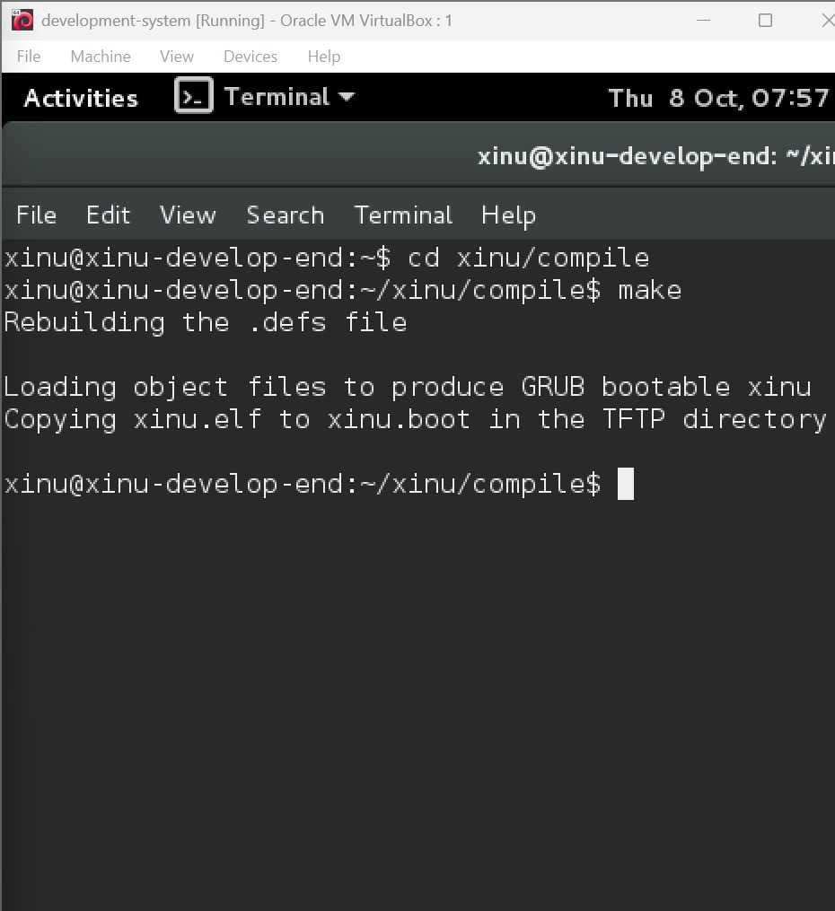

# Laporan Praktikum Sistem Operasi
## Modul 1, 2, dan 3: Instalasi, Arsitektur, dan Eksplorasi Xinu OS

### Identitas Praktikan
| Item | Keterangan |
|------|------------|
| **Nama** | Lovy Armanda Rossy |
| **NIM** | 108072500049 |
| **Kelas** | IF 05-04 |
| **Asisten Praktikum** | Nuevalen Refitra Alswando |
| **Tanggal Praktikum** | 25-09-2026 |

---

## 1. Tujuan Praktikum
1. Memahami aturan, tata tertib, dan persiapan tools utama praktikum Sistem Operasi, seperti VirtualBox, Ubuntu, Xinu OS, dan Sourcetrail.
2. Memahami arsitektur cross-development pada sistem operasi embedded Xinu, yang memisahkan Development-System VM dan Backend VM.
3. Mampu melakukan kompilasi source code Xinu dan menjalankannya pada target machine melalui jaringan PXE/TFTP.
4. Mampu mengakses serta mengeksplorasi perintah dasar shell Xinu melalui koneksi serial port menggunakan Minicom.

---

## 2. Dasar Teori dan Arsitektur Sistem
Xinu OS merupakan sistem operasi kecil yang dirancang untuk lingkungan embedded. Model pengembangannya mengikuti paradigma cross-development, di mana pengembang menulis dan mengompilasi kode pada mesin host (komputer biasa) lalu menjalankannya pada perangkat target.

Pada praktikum ini, arsitektur yang digunakan terdiri dari dua mesin virtual:
1. **Development-System VM**: berisi Debian Linux, source code Xinu, compiler, DHCP Server, dan TFTP Server.
2. **Backend VM**: mesin target kosong yang akan melakukan booting melalui jaringan (PXE), mengambil image Xinu dari server TFTP, dan menjalankan Xinu OS.

Kedua VM dihubungkan melalui virtual serial port agar praktikan dapat memberikan perintah ke Xinu dari terminal Development-System.

Keunggulan dari arsitektur ini adalah proses pengembangan dapat dilakukan di lingkungan yang lebih mudah dikendalikan, sementara target mesin tetap berperilaku seperti perangkat embedded yang sesungguhnya.

---

## 3. Langkah Kerja dan Hasil Eksplorasi

### 3.1 Login dan Kompilasi Source Code Xinu
Langkah pertama dilakukan pada Development-System VM. Setelah VM dinyalakan, praktikan masuk ke sistem operasi Debian menggunakan akun yang telah disediakan.

- **Username**: `xinu`
- **Password**: `xinurocks`

Setelah login, praktikan membuka terminal dan masuk ke direktori kompilasi Xinu. Langkah berikutnya adalah membersihkan build lama agar file hasil kompilasi yang dibuat merupakan versi terbaru dan tidak tertinggal.

```bash
$ cd xinu/compile
$ make clean
$ make
```

**Hasil**: Proses `make` akan mengompilasi seluruh kode sumber C menjadi image Xinu yaitu `xinu.elf`. Image tersebut kemudian akan disalin ke direktori TFTP agar siap di-boot oleh mesin target. Proses kompilasi ini merupakan tahapan penting karena semua program dan kernel Xinu dibangun di sini sebelum dijalankan di Backend VM.



*Gambar 1: Proses kompilasi source code Xinu menggunakan perintah `make` pada Development-System VM.*

### 3.2 Booting Backend VM melalui PXE
Setelah image Xinu selesai dibuat, praktikan menyalakan Backend VM. Karena VM target tidak memiliki sistem operasi yang terpasang di hardisk, maka sistem akan melakukan network booting melalui PXE.

Tahapan yang terjadi adalah:
1. Backend VM menampilkan bootloader GRUB.
2. VM meminta IP address dari DHCP Server yang berjalan pada Development-System VM.
3. Backend VM mengunduh file `xinu.boot` dari TFTP Server.
4. Xinu OS dimuat ke memori dan berjalan.

Proses ini menunjukkan bahwa perangkat target tidak memerlukan media penyimpanan lokal untuk menjalankan sistem operasi, karena semua file boot diambil dari jaringan.


*Gambar 2: Tampilan Backend VM saat melakukan booting melalui jaringan (PXE) dan memuat GRUB.*

### 3.3 Koneksi Serial Port Menggunakan Minicom
Untuk berinteraksi dengan sistem yang sedang berjalan di Backend VM, praktikan kembali ke Development-System VM lalu menjalankan aplikasi Minicom sebagai terminal serial.

```bash
$ sudo minicom
```

Password yang digunakan saat menjalankan Minicom adalah:

```bash
xinurocks
```

**Hasil**: Terminal Development-System terhubung langsung ke console Xinu di Backend VM. Prompt berubah dari format Linux biasa menjadi `xsh$`, yang menandakan bahwa praktikan sudah masuk ke shell Xinu.


*Gambar 3: Koneksi berhasil melalui Minicom, ditandai dengan munculnya prompt `xsh$`.*

### 3.4 Eksplorasi Perintah Shell Xinu
Setelah masuk ke prompt `xsh$`, praktikan mulai mengeksplorasi command yang tersedia pada Xinu. Perintah yang pertama dicoba adalah `help` untuk melihat daftar perintah dasar yang dapat dijalankan.

```bash
xsh$ help
```

Hasil dari perintah ini menampilkan berbagai command dasar seperti perintah untuk melihat isi direktori, navigasi, serta fungsi shell Xinu. Hal ini membuktikan bahwa Xinu memiliki shell minimal namun cukup fungsional untuk keperluan embedded system.

Selain itu, praktikan juga mencoba perintah seperti `ls`, `cd`, dan beberapa perintah dasar lainnya untuk memahami struktur file dan mekanisme navigasi shell Xinu.


*Gambar 4: Output dari perintah `help` yang menampilkan daftar command bawaan Xinu OS.*

---

## 4. Pembahasan
Berdasarkan praktikum yang telah dilakukan, terdapat beberapa poin penting dalam arsitektur dan cara kerja Xinu OS:

1. **Pemisahan Host dan Target (Cross-Development)**
   Penggunaan dua VM merepresentasikan kondisi nyata pada pengembangan sistem embedded. Proses kompilasi dilakukan di mesin host yang lebih kuat, sementara mesin target hanya berfungsi menjalankan program hasil kompilasi.

2. **Mekanisme Network Booting (PXE & TFTP)**
   Backend VM tidak memerlukan media penyimpanan lokal. Saat dinyalakan, NIC virtualnya mencari DHCP server yang menyediakan alamat IP dan mengarahkan ke server TFTP untuk mengambil image `xinu.boot`.

3. **Peran Serial Port dan Minicom**
   Karena target tidak memiliki antarmuka grafis, komunikasi dilakukan melalui serial port. Minicom berfungsi sebagai terminal emulator yang menghubungkan host dengan target secara serial.

4. **Xinu Shell (`xsh$`)**
   Shell Xinu sangat ringkas dan minimalis. Ia menerima input pengguna, mengekstrak nama perintah, lalu memanggil fungsi sistem atau kernel yang sesuai. Struktur ini mirip dengan sistem operasi embedded yang dirancang untuk efisiensi dan penggunaan memori yang kecil.

Dengan demikian, praktikum ini tidak hanya mengajarkan cara menjalankan Xinu, tetapi juga membantu memahami bagaimana sistem operasi embedded bekerja di lingkungan nyata.

---

## 5. Kesimpulan
1. Praktikan telah memahami tata tertib dan persiapan lingkungan praktikum Sistem Operasi.
2. Arsitektur Xinu OS menggunakan konsep cross-development yang memisahkan mesin pengembang dan mesin target.
3. Proses `make` berhasil menghasilkan image Xinu yang siap dijalankan melalui PXE dan TFTP.
4. Praktikan berhasil mengakses shell Xinu (`xsh$`) melalui Minicom dan melakukan eksplorasi perintah dasar.
5. Pemahaman terhadap booting, serial communication, dan shell Xinu menjadi fondasi penting untuk materi praktikum Sistem Operasi selanjutnya.

---

## 6. Referensi
- Referensi utama: `@ValenNz/sisop-praktikum` pada folder `modul01`
- Dokumentasi Xinu OS
- Panduan praktikum Sistem Operasi
- Oracle VM VirtualBox Documentation
